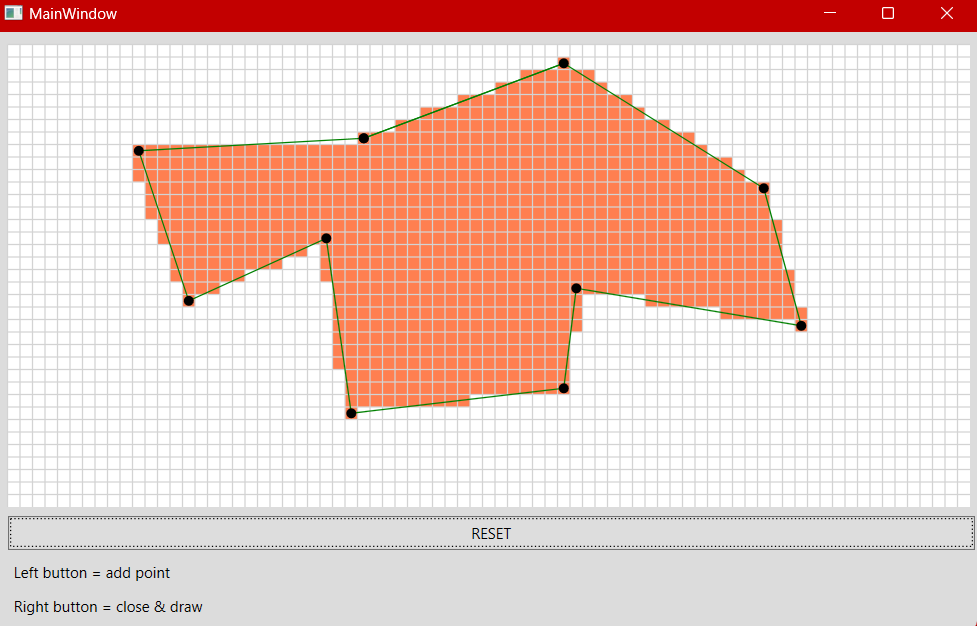

# Scanline

The Scanline Algorithm is a fundamental computer graphics technique used for rendering two-dimensional images. It focuses on efficiently filling polygons with color, shading, or texture. The algorithm works by scanning horizontally across the image, processing each horizontal line (scanline) that intersects the polygon.

